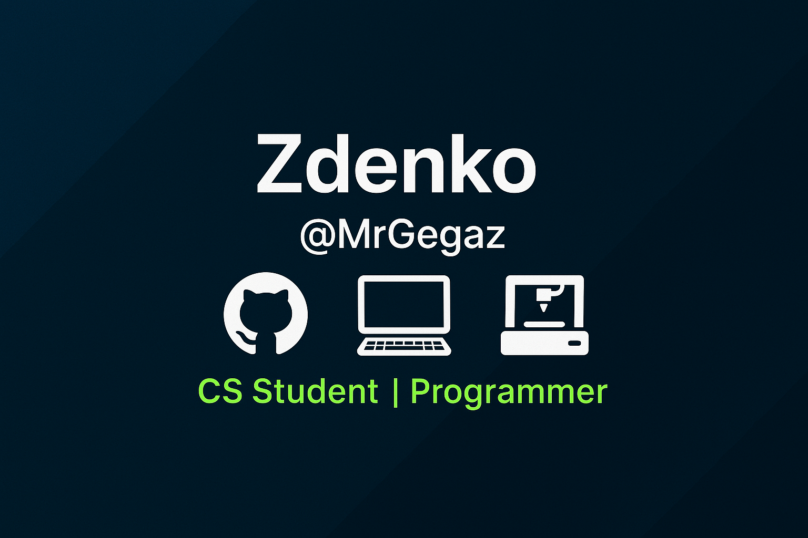

---

# 👋 Hi there, I'm Zdenko (aka MrGegaz)

🎓 I'm a computer science student who’s still exploring which path to follow in tech - because too many things seem interesting until I try them out!\
🎮 In my free time, I enjoy gaming, airsoft, hiking, tinkering with DIY projects and hanging out with my wife and dog 🐶.

---

## 💡 About Me
- 🔭 Currently exploring which path in programming to take.
- 🧠 Interested in IoT, app development, 3D printing, and game dev (I'd love to make an indie game one day!)
- ✍️ I also do some 3D modeling for my 3D printing needs.

---

## 🛠️ Languages & Tools
Here are some of the technologies that I've worked with or am familiar with:

```text
💻 Languages: HTML • JavaScript • CSS • SQL • PHP • C++ • C# • Java • Kotlin • Python
🛠️ Tools:     GitHub • GitLab • Visual Studio Code • JetBrains • Android studio • Unity • AvaloniaUI • Linux • Windows
```

---

## 📌 Projects
- 📟 **Daktilografija (Typing App)** - A group project where we refactored and completed a typing application started by previous students.
  We focused on code cleanup, bug fixing, and adding features to make the app functional again.

_(More projects coming soon - stay tuned!)_

---

## 🔭 I’m currently working on
- Learning Flutter, React, NestJS and PostgreSQL for my student job.

---

## 🌱 I’m currently learning
- .NET.
- Kotlin.
- Unity.
- Flutter
- React
- NestJS
- PostgreSQL

---

## 🌐 Connect with Me
- 🔗 [LinkedIn](#) *(link to be added)*
- 🔗 [Telegram](#) *(link to be added)*
- 📧 You can reach me at: **mrgegaz.dev@gmail.com**

(I may respond during evenings or weekends; however, please feel no pressure to reply outside your normal working/available hours.)

---

## ⚡ Fun Facts
- I always try to fix things myself before asking for help 🔧
- I'm an airsoft enthusiast and a big fan of everything DIY
- I enjoy combining tech with my hobbies - especially when it involves 3D printing or microcontrollers 😎

---

Thanks for stopping by! Feel free to check out my projects or say hi!
